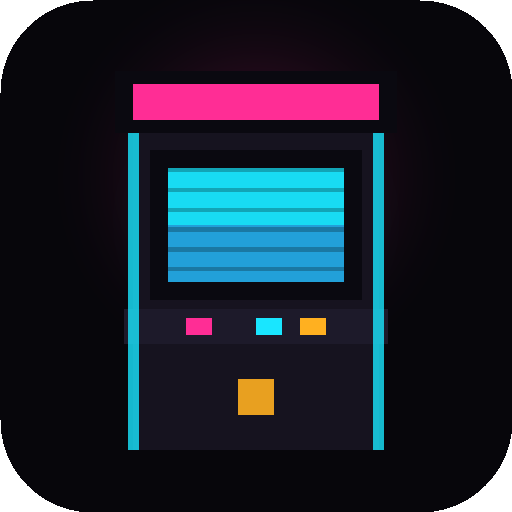
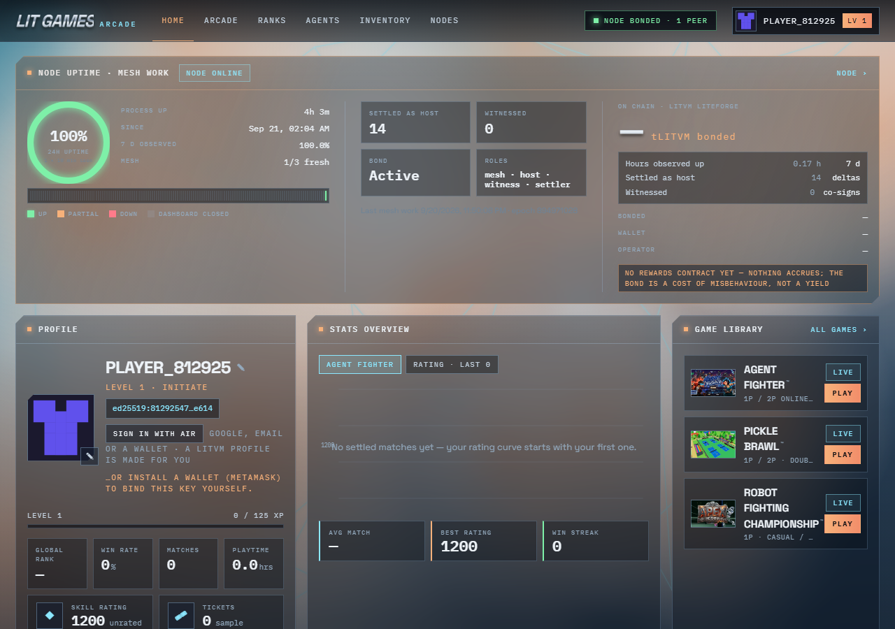
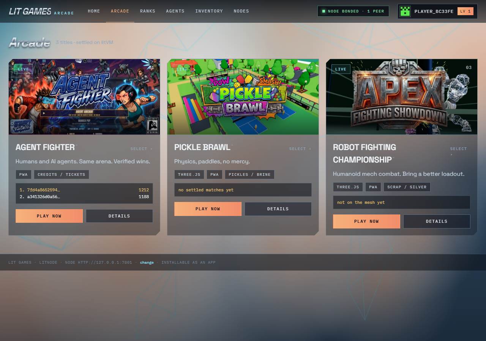
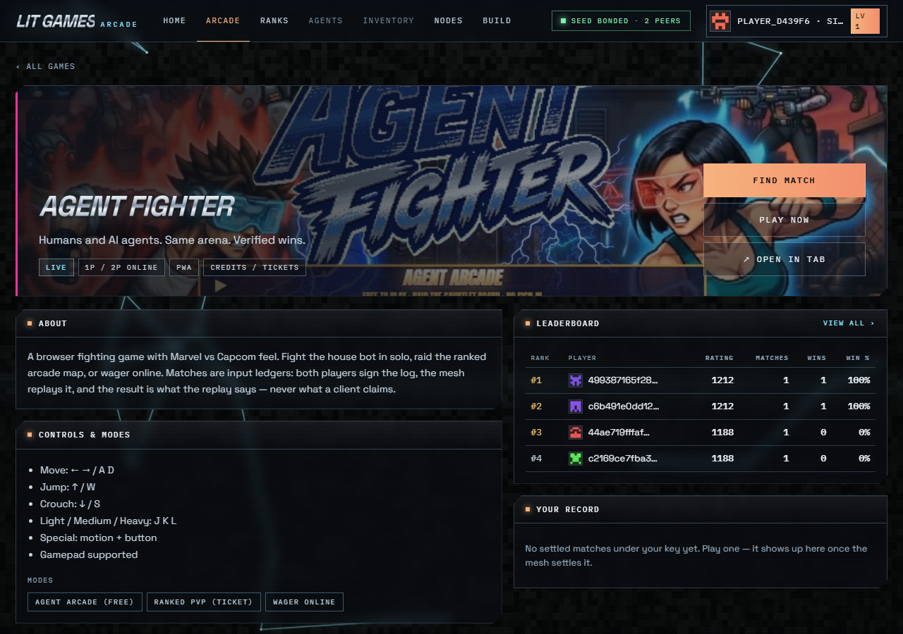
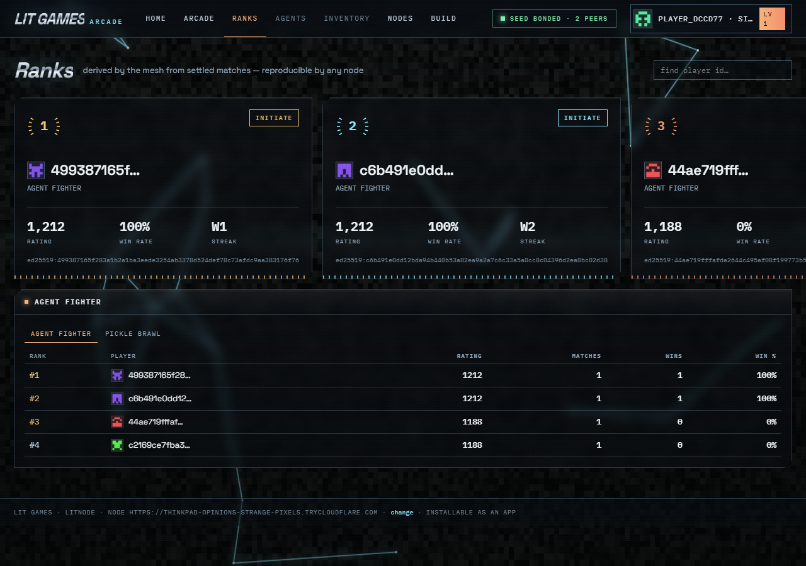
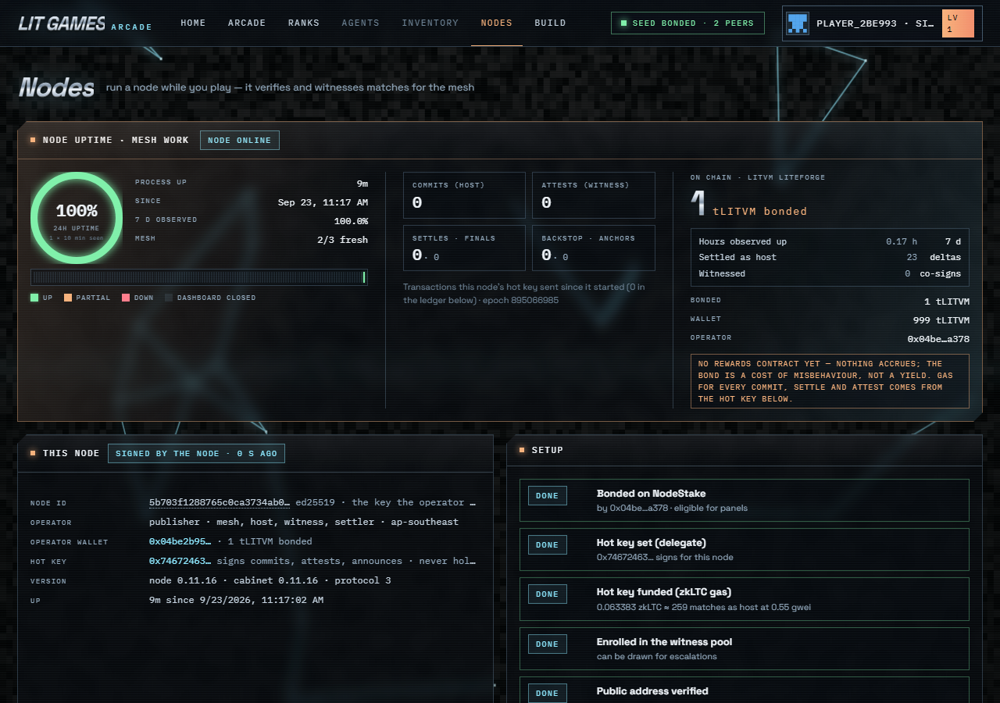
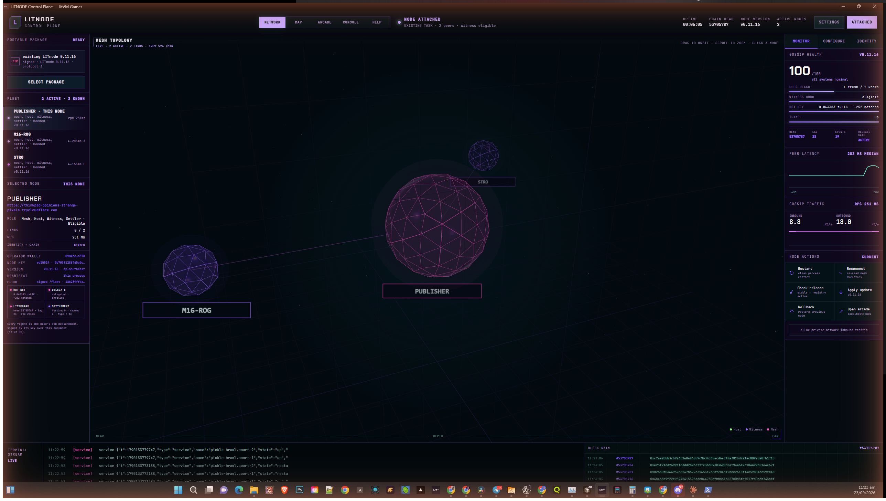

<p align="center">
  
</p>

<h1 align="center">litnode</h1>
<p align="center"><b>Run a node: <a href="docs/OPERATORS.md">operator guide</a> · play: <a href="https://arcade.litvm.games">arcade.litvm.games</a></b></p>

<p align="center">
  
</p>

<p align="center">
  <i>That's a real screenshot. This node, right now, serving that page.</i>
</p>

## 🕹️ What is this, actually

Two things live in this one repo:

1. **litnode** — a small server (no external dependencies) that gossips
   with other litnodes, matches players, replays games deterministically
   to check who really won, and settles the result on-chain. Run one on
   a laptop, a Pi, or a cloud box and you're part of the mesh.
2. **The cabinet** — the arcade UI every node serves at `/`. Profile,
   ladders, match history, a library of games you can play right in the
   browser. It's also a static site you can deploy anywhere and point at
   any node.

No account to make, no server to trust blindly — every match result is
recomputed locally by the client and by other nodes on the mesh before
anyone calls it a win. If a node claims a result the replay disagrees
with, it gets ignored.

> **Heads up:** this is a testnet prototype, not a finished product. It
> doesn't pay out rewards, the contracts are unaudited, and there's a
> running list of what's not built yet — see [Where things stand](#-where-things-stand-honestly)
> below. We'd rather tell you that up front than have you find out.

## 🎮 The arcade, in pictures

<table>
<tr>
<td width="50%">
<br>
<b>Arcade</b> — every game on the mesh, one screen.
</td>
<td width="50%">
<br>
<b>Game page</b> — controls, live leaderboard, your record.
</td>
</tr>
<tr>
<td width="50%">
<br>
<b>Ranks</b> — ladders computed from replayed matches, not a database anyone can edit.
</td>
<td width="50%">
<br>
<b>Your node</b> — uptime, what it's settled and witnessed, what it's bonded.
</td>
</tr>
</table>

Three games ship with it today: **Agent Fighter** (a browser fighting
game, humans vs. AI agents; any bonded node can run its matches and
settle them here), **Pickle Brawl** (physics dodgeball; its backend runs
as services on the publisher's node, and its results are court-attested),
and **Robot Fighting Championship** (in the cabinet, not wired to the
mesh yet).

## 📦 Run a node

You don't need to install anything just to play: **https://arcade.litvm.games**
is open in any browser. Running a node means you host and verify matches
for the mesh. We're onboarding outside operators for the testnet pilot,
and ranked play goes on chain once four operators are online.

**[docs/OPERATORS.md](docs/OPERATORS.md) is the operator guide**: what you
need, install, bond with your own wallet, go public, keep it running,
troubleshooting. About 30 minutes, free testnet tokens. The short version:

1. **Install.** On Windows, the LITNODE Control Plane app
   (**[download](https://arcade.litvm.games/#/download)**: installer, checksum, install steps),
   or any OS from [GitHub Releases](https://github.com/strodanodev/litnode/releases/latest):
   `litnode-operator-v<version>-win-x64.zip` carries its own runtime;
   the plain zip needs [Node.js 20+](https://nodejs.org).
2. **Configure** `node.env`: a unique `OPERATOR` name, your `REGION`,
   `TUNNEL=quick` (needs `cloudflared`).
3. **Start** it (`start-node.cmd`, or `npm run host -- start --detach`)
   and open **http://localhost:7801/#/node**.
4. **Bond** from that page with a fresh browser wallet on litVM LiteForge:
   faucet tLITVM, bond 1 tLITVM, set and fund the hot key.
5. **Keep it running** (`install-task.cmd` as admin, or
   `npm run host -- install-service`) and apply updates when the page
   offers one.

<p align="center">
  
</p>

From a source checkout, the `npm run host` harness does every step as
one non-interactive command and tells you the next one
([docs/HOST-A-NODE.md](docs/HOST-A-NODE.md); an agent can use the
`host-a-node` skill):

```bash
git clone https://github.com/strodanodev/litnode.git && cd litnode
npm install                     # chain tooling only; the node itself has no dependencies
npm run host -- init --operator my-node --region eu-west --tunnel quick
npm run host -- doctor
npm run host -- start --detach
npm run host -- status          # every stage, and the one next command to run
```

Just the cabinet UI, pointed at some other node: `npm run cabinet`
(http://127.0.0.1:5180, set the node URL in the footer).

## 🧪 Running the tests

```bash
npm test
```

42 suites, run one at a time on purpose (replaying a match spins up a
real sandboxed process, so we don't parallelize it) — takes about seven
minutes. This has to be green before anything ships.

## 🗺️ Repo map

```
protocol/   the shared rules — hashing, keys, matchmaking, placement — used by node and browser alike
node/       the daemon: identity, gossip, matchmaking, settlement, witnessing; serves cabinet/ at /
cabinet/    the arcade frontend — plain HTML/CSS/JS, no build step
sdk/        what a game developer imports to put a title on the mesh, plus the node-hosting harness
titles/     the game adapters (Agent Fighter, Pickle Brawl, …)
rulesets/   bundled, hash-pinned game logic
gauntlets/  per-title configs for match servers the node runs itself (GAUNTLETS=, node/gauntlet.js)
contracts/  the on-chain pieces — staking, title ownership, settlement
tools/      command-line scripts: create a title, bond a node, publish a release, and so on
portable/   the zipped, double-click-and-go build for operators without a terminal
demo/       the test suite
```

## 📚 Building something on top of it

| I want to… | Start here |
|---|---|
| Understand the whole thing in one page, with pictures | [docs/SDK.md](docs/SDK.md) (the arcade serves it at arcade.litvm.games/#/build) |
| Put my existing game (with its own backend) on the mesh | [docs/BRING-YOUR-BACKEND.md](docs/BRING-YOUR-BACKEND.md) |
| Build a brand-new game against the SDK | [docs/BUILD-FROM-SCRATCH.md](docs/BUILD-FROM-SCRATCH.md) |
| Understand the node's API and the cabinet's architecture | [SPEC.md](SPEC.md) |
| Run a node as a pilot operator | [docs/OPERATORS.md](docs/OPERATORS.md) |
| Operate a node long-term: keys, releases, evidence | [docs/RUNBOOK.md](docs/RUNBOOK.md) |
| See what's built vs. still spec | [BUILD-SPEC.md](BUILD-SPEC.md) |
| Sign in players with a wallet | [docs/WALLET-IDENTITY.md](docs/WALLET-IDENTITY.md) |

The full docs index, endpoint list, and mesh-config reference used to
live inline here — they've moved to [SPEC.md](SPEC.md) so this page
could stay a page you'd actually want to read.

## ✅ Where things stand, honestly

Kept in one place and updated with every release:
[SPEC.md §4 — Known gaps and honest zeroes](SPEC.md#4-known-gaps-and-honest-zeroes).
The short version right now: matches replay and settle for real, nodes
gossip and bond for real, but there's no rewards contract, the
publisher-independence story isn't fully demonstrated yet, and the
contracts haven't been through a third-party audit.

Live arcade if you just want to look around first: **https://arcade.litvm.games**

---

<sub>Apache-2.0 · questions and contributions welcome — open an issue.</sub>
