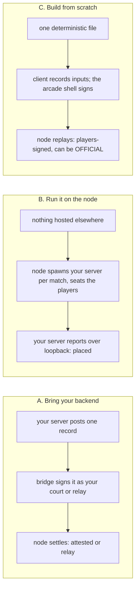
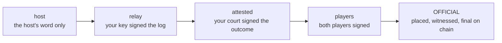
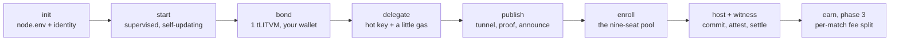

# The litnode SDK, in one page

The instructions a publisher, a developer or an agent needs to make a game
litnode-compatible, current for litnode **0.11.15** (protocol 3, settlement
v1.0 on `MatchBook`). The same text is served by every node's cabinet and
by the arcade at **arcade.litvm.games/#/build** (`cabinet/build.js`), with
the "for dummies" pictures. Everything here is code you can run; nothing is
promised that a test does not exercise.

The map of the longer docs is [PUBLISHERS.md](PUBLISHERS.md). This page is
the short form.

## For dummies: how everything works

You have a game. Players play it. At the end somebody has to say who won,
and everybody else has to be able to trust that. That is the whole problem.

### One match, start to finish

```mermaid
flowchart LR
  P[Player finds a match<br/>signs a queue entry] --> A[Arcade verifies<br/>recomputes the draw itself]
  A --> N[Node places it<br/>beacon from a chain block]
  N --> C[Host commits on MatchBook<br/>match + 3 witnesses]
  C --> Y[You run the match<br/>your server, relay or client]
  Y --> R[One record leaves<br/>input log or signed report]
  R --> S[Host settles<br/>replays it in a sandbox]
  S --> W[3 witnesses attest<br/>other operators, same hash?]
  W --> F[Chain finalizes<br/>2 agree, nobody dissents]
  F --> L[Ladder updates<br/>folded from chain events]
```



Nothing on the ladder comes from anyone's word. A match is a signed input
log, or, for a game that cannot be replayed, a signed report from your own
court. The host node re-runs it, three witness nodes under other operators
re-run it too, and the result is only **official** once the chain says
they agreed. A witness that reaches a different answer files a dispute,
and nine more nodes are drawn to settle it.

### Who holds which key

| key | where | what it does |
|---|---|---|
| Player key | the browser | signs queue entries and the end of every match; can be bound to a wallet once |
| Node key | `identity.json` on the node | signs heartbeats, placements, deltas; what NodeStake bonds |
| Hot key (delegate) | the node process | pays gas for commit, settle, attest, finalize; never holds the bond |
| Operator wallet | your shell, for one command | bonds the node, names the delegate; never on the node |
| Court or relay key | your server | signs outcome reports (attested) or input logs (relay); listed in `COURTS` / `RELAY_KEYS` |
| Publisher wallet | your wallet | holds the title as an ERC-721 on TitleRegistry and bonds the host that lists it |

No single key can do everything, on purpose. A leaked hot key costs gas,
not a bond. A leaked court key costs one title's reports until you rotate
it. The wallet that matters is never on a server.

### Three ways in



### What a result can be called



Left to right, more trust. Only a replayable match that the mesh placed,
both players signed and the witnesses agreed on becomes official. An
attested game is on the ladder, labelled, and stays there.

### A node's life



Every step is one command, and the arcade's Nodes page shows the same
checklist live, read from the node's signed `/fleet` and the chain. A node
that is not bonded still listens; only a bonded one is drawn.

## SDK instructions

### Prerequisites

Commands are shown for bash and zsh. In PowerShell write `$env:NAME="value"`; in cmd, `set NAME=value`.

| need | why |
|---|---|
| Node.js 20+ | the node and every tool; a game engine of your own may need 22+ |
| the repository | `git clone https://github.com/strodanodev/litnode`, then `npm install` once (esbuild for conformance and bundling, ethers for the chain tools) |
| cloudflared | public reachability with no router or certificate; on PATH |
| a wallet with test tokens | tLITVM to bond (faucet in the arcade), a little zkLTC for the hot key (Caldera faucet) |
| an agent, optionally | `host`, `bridge` and `fleet` answer in JSON with `--json` and never prompt; the other tools print text and exit non-zero on failure; the skills in `.claude/skills` walk each path |

### 1. Which kind of title

```bash
npm run bridge -- assess --input-log yes|no --deterministic yes|no --engine-open yes|no
```

| kind | you have | the mesh does |
|---|---|---|
| replayable | per-tick inputs, deterministic, bundles as one import-free module | re-runs it; witnesses re-run it; can be OFFICIAL |
| attested | anything else: float physics, closed engine, no input log | your court signs the outcome; the node validates it; labelled, never official |

### 2. The title file

```bash
npm run create-title -- my-game.v1 "My Game"
npm run conformance -- titles/my-game.v1.mjs
npm run bundle:title -- titles/my-game.v1.mjs      # rulesets/my-game.v1.js + .json { buildHash }
```

Replayable: `init / step / done / serialize / view / scores` and a manifest
with `display`. Attested: `validate(report)` and `scores(report,
participants, teams)`. Integers or `seededRandom`; never the clock, the
network or storage. The conformance suite is the gate every node runs
before loading you. Full rules: [HOST-YOUR-TITLE.md](HOST-YOUR-TITLE.md).

### 3. Claim it

```bash
export PUBLISHER_KEY=0x...                  # the wallet that holds the title; bond the host from this same wallet (step 5), or the title is not listed
npm run publish:title -- register rulesets/my-game.v1.js
npm run publish:title -- set-build rulesets/my-game.v1.js   # a retune, active after the delay
npm run publish:title -- status rulesets/my-game.v1.js
```

A title is an ERC-721 on TitleRegistry: whoever holds it is the publisher,
and a hand-over is a transfer. Nodes load a build from the chain's word.
The arcade lists a registered title only while a bonded node from the same
wallet hosts it; registered but unhosted is not listed and nothing is lost.
Spec: [PUBLISHER-BONDS.md](PUBLISHER-BONDS.md).

### 4A. Bring your backend

```bash
npm run bridge -- key --kind attested --ruleset my-game.v1     # prints COURTS=my-game.v1:<publicKey> for the node operator
export BRIDGE_TOKEN=<random, 16+ chars>
npm run bridge -- serve --port 8480 --node auto --ruleset my-game.v1 --kind attested
# or, with no server change:
npm run bridge -- watch --adapter jsonl --source ./results.jsonl --node auto --ruleset my-game.v1 --kind attested
npm run bridge -- check <matchId> --node auto --ruleset my-game.v1
```

Your server POSTs the unsigned submission to the bridge's `/submit` at match end with
`authorization: Bearer $BRIDGE_TOKEN`; the bridge signs and forwards it.
`--node auto` finds the live node through NodeDirectory on chain, so
nothing is pinned to a hostname that rotates. Shapes, adapters and the
worked example (Pickle Brawl): [BRING-YOUR-BACKEND.md](BRING-YOUR-BACKEND.md).

### 4B. Run your match server on the node

```json
{ "command": "${node}", "args": ["node_modules/tsx/dist/cli.mjs", "services/court/src/court.ts"], "cwd": "/your/checkout",
  "env": { "PORT": "${port}", "COURT_TICKET_SECRET": "${secret}", "COURT_PUBLIC_URL": "${publicUrl}",
           "LITNODE_SEATS": "${seats}", "LITNODE_URL": "${nodeUrl}", "COURT_IDENTITY": "/path/court-key.json" },
  "portRange": [7777, 7787], "readyMs": 120000, "ttlMs": 900000, "settledGraceMs": 5000 }
```

`GAUNTLETS=my-game.v1=./gauntlets/my-game.json` and `RELAY_PORT=8478` in the
node's `node.env` (a node that already fronts another title's relay on `RELAY_PORT`
sets `GAUNTLET_GATEWAY_PORT=8478` instead). `${node}` is the node's own runtime. The node spawns your process for each match it hosts,
mints one HMAC join ticket per placed player (`{ sub, matchId, team, slot,
mode, exp }`), serves them at `https://<wsAddr host>/<room>/ticket?player=<key>`,
proxies `wss://<wsAddr>/<room>` to it, and ends it a few seconds after the
match settles. Your client reads `?ws&room&player&match` from the arcade
launch, fetches its ticket, joins. Section 6a of BRING-YOUR-BACKEND.md.

### 4C. Build from scratch

```js
import title from './my-game.v1.mjs';
import { connectShell, createSim, createRecorder, matchSeed, externalAgents, settle } from './litnode/sdk/client.js';   // the litnode checkout (no npm package yet)
const shell = await connectShell();              // cabinet:init → { player, node, match, chain }
const m = shell.match;                           // matchId, hostAddr, participants, mode, buildHash, wsAddr
if (!m) throw new Error('opened with Play, not from a placed match: nothing to settle');
const sim = createSim(title, { seed: matchSeed(m), participants: m.participants, ctx: { agents: externalAgents(m.participants) } });
const rec = createRecorder({ matchId: m.matchId, participants: m.participants, rulesetId: 'my-game.v1', buildHash: m.buildHash, mode: m.mode });
// each tick:  sim.step(inputs); rec.record(inputs); render(sim.view());
// at the end: await settle({ nodeUrl: m.hostAddr, recorder: rec, signers: { [shell.player.id]: shell, [them]: theirSig } });   // theirSig: the other player's, over your transport
```

The client imports the same file the node replays. The arcade shell signs
the ledger head for the player (`cabinet:sign`), so the key never enters
your game. Transport between players is yours. [BUILD-FROM-SCRATCH.md](BUILD-FROM-SCRATCH.md).

### The arcade shell protocol

| direction | message | meaning |
|---|---|---|
| game → shell | `cabinet:hello` | ask for init |
| shell → game | `cabinet:init { player, node, game, chain, match? }` | identity, the node, the contract set, the placement |
| game → shell | `cabinet:sign { body }` | the player's signature over `{ matchId, ticks, head, buildHash }`, only for the match launched |
| shell → game | `cabinet:signed { matchId, player, sig }` | or `{ error }` |
| game → shell | `cabinet:played { matchId }` | the placed match was played; the arcade closes the title |
| game → shell | `cabinet:exit` | back to the launcher |
| game → shell | `cabinet:air { id, token? }` · `cabinet:air-login { id }` · `cabinet:air-logout { id }` | universal login: the arcade's AIR session, a fresh token, the arcade's sign-in dialog, sign-out. Answered only for titles the arcade lists with `login: 'arcade'`, at their own origin |
| shell → game | `cabinet:air { re?, signedIn, user, token?, error? }` | the answer (`re` = request id), or a push when the session changes |

Drop-in helper for init and exit only: `cabinet/sdk-client.js` (a no-op outside the arcade); to sign, use `connectShell` from `sdk/client.js`. Launch
URL for a placed match: `?ws=<relay>&room=LIT-…&player=<key>&match=<id>&build=<hash>`.

### 5. Run a node

```bash
npm run host -- init --operator my-studio --roles mesh,host,witness,settler --rulesets ./rulesets/my-game.v1.js --tunnel quick
npm run host -- doctor && npm run host -- start --detach
export OPERATOR_KEY=0x...                       # your wallet (the PUBLISHER_KEY wallet), this shell only
npm run host -- bond                            # 1 tLITVM on testnet
npm run delegate -- <nodeId> <announcer address> --fund 0.005   # the hot key the node sends with
npm run host -- publish --fund 0.02             # tunnel, proof of possession, announce on NodeDirectory
npm run enroll -- <nodeId>                      # the nine-seat escalation pool
unset OPERATOR_KEY
npm run host -- install-service && npm run host -- verify
```

Or the same from the arcade's Nodes page with a wallet: Bond this node,
name the delegate, enroll, and a live setup checklist read from the
node's signed `/fleet`. `npm run fleet` is the same document in a
terminal; `npm run fleet -- relay` walks a title's path from the outside.
[HOST-A-NODE.md](HOST-A-NODE.md).

### 6. What settles, exactly

| call | who, when | what it carries |
|---|---|---|
| `commit` | host's hot key, at placement | the match and its three drawn witnesses, under other operators |
| `settle` | host, when the record lands | result hash, ledger sha256, build, participants, scores |
| `attest` ×3 | each witness, inside the window | the hash it reached itself; a different hash is a dispute |
| `finalize` | anyone, after the window | two agree and none dissent: final; otherwise escalated |
| `escalate` / `resolve` | anyone posts the ledger; nine drawn from the enrolled pool | stake-weighted majority; losers are slashed through NodeStake |
| `propose` (hourly) | the settler | the hour's finalized set as a Merkle root on EpochAnchor |

Ladders are a fold over these events in block order, so every node and the
arcade derive the same tables from RPC alone. Elo stays off chain. Windows
and slash sizes live in the contract and are read at start.

### 7. Said plainly

- Testnet contracts, unaudited. No fees, rewards or credits reconcile on
  chain yet; the per-match fee split is phase 3.
- The character registry is deployed and empty: every match hydrates
  external, zero-stat agents until one is forged.
- An attested title cannot become official by configuration; the path is
  on your side (seeded randomness, integer math, an input log).
- Keys are read from the shell, once. No flag or file in the repository
  takes one.
- The full list: [SPEC.md section 4](../SPEC.md#4-known-gaps-and-honest-zeroes).

### Where things are

| file | what |
|---|---|
| `docs/PUBLISHERS.md` | the map: paths, vocabulary, the seven developer steps |
| `docs/HOST-YOUR-TITLE.md` | the title contract and the rules of recognition |
| `docs/BRING-YOUR-BACKEND.md` | bridge, gauntlet loops, node discovery |
| `docs/BUILD-FROM-SCRATCH.md` | the client SDK and the shell protocol |
| `docs/HOST-A-NODE.md` | the node harness, stage by stage |
| `docs/PUBLISHER-BONDS.md` | titles as tokens, host grants, escalation seats |
| `docs/UNIVERSAL-LOGIN.md` | sign in with AIR, proxy wallets, one profile |
| `docs/FLEET-TELEMETRY.md` | `GET /fleet`, the signed operator document |
| `.claude/skills/` | `host-a-node`, `migrate-a-title`, `build-a-title`, `host-a-title` |
| `cabinet/build.js` | this page, as the arcade serves it |
